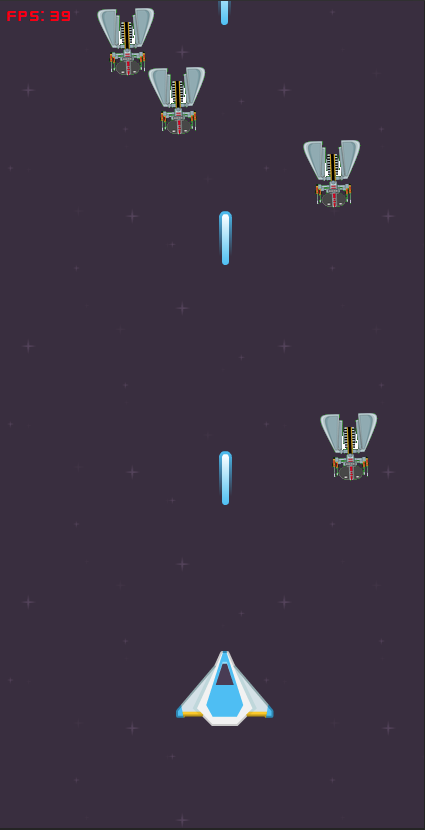

# POC - Spaceshooter (Game with Blazor Wasm)
This is a POC with which I wanted to test how performant a game can be programmed with Blazor. For this purpose, a "mini" engine was built that was similar to Unity. All elements in the game are own Blazor components and are added or removed to the DOM in real time.
<br><br>
I have no rights to any of the images I used. The images serve only as placeholders. If the owner of the pictures has objections, I will remove them again. This means that the images may not be used any other way.

<br>

```
Developed:
- 25/26 December 2021

Functions:
- Optimised for desktop & mobile (mouse & touch, FPS capped to 40)
- Mouse & Touch Input
- Polygon Collisions Detection
- Render dynamic components as fragment live in the DOM
- Sounds & Background music

Used tools:
- Visual Stuio 2022
- dotnet 6 (without extensions / dependencies)
```
<br>

Demo: <br>
https://michalsy.github.io/blazor-game-spaceshooter/

<br>

Preview:
<br>
